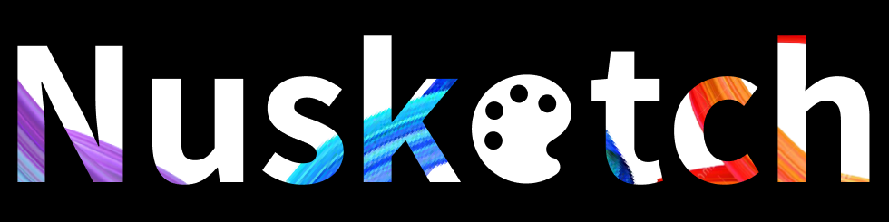

    

## INTRODUCTION

Autism spectrum disorder (ASD) refers to a variety of neurodevelopmental disorders. Some of these disorders can affect a person’s ability to communicate, socialize, behave, and develop. They may be faced with challenges in social skills, repetitive behaviors, and verbal or nonverbal communication. People with autism are often visual thinkers, and art can help those with autism express themselves through a soothing activity. However, there are not many applications developed for people with ASD. We at Nusketch aim to develop an application where people with ASD can improve through art therapy. Our solution allows users to experience artistic and communicative growth by taking pictures of the real world and converting it into a traceable sketch, which can then be colored. This allows for endless creativity for users to help express themselves. Additionally, our application allows users to create visual cards of objects and concepts; people with ASD can use them to communicate and provide structure and routine in their lives. People with ASD are often visual learners and we want to create a platform that will help them with wellness.                 

## TECHNOLOGIES
1. [Flutter](https://docs.flutter.dev)
2. [Dart](https://dart.dev/guides)
3. [OpenCV](https://opencv.org)
4. [Firebase](https://firebase.google.com/docs)

## UI

   

