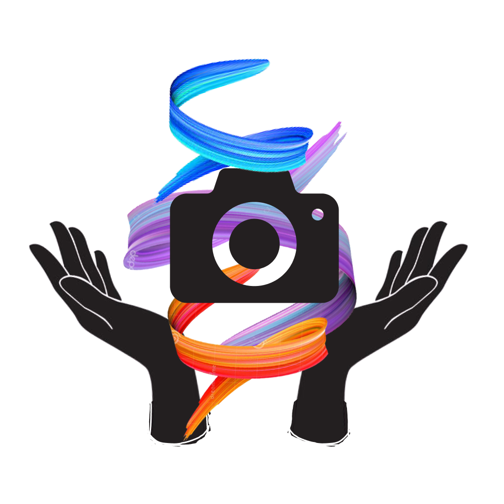

    

    

## **Team Members:**

[Hussam Marzooq](hmarzoo000@citymail.cuny.edu)  
[Willie Shi](wshi000@citymail.cuny.edu)  
[Jessie Su](jsu001@citymail.cuny.edu)  

*Computer Science Students at The City College of New York*

**Faculty Advisor:**  
Zhigang Zhu, Kayser Professor of Computer Science, 
Grove School of Engineering, The City College of New York

**Industrial Mentor:**  
Celina Cavalluzzi, Assistant Vice President, Day Services Director, Goodwill NY/NJ

## **INTRODUCTION**

Autism Spectrum Disorder (ASD) refers to a variety of neuro-developmental disorders. Some of these disorders can affect a person’s ability to communicate, socialize, behave, and develop. People with autism are often visual thinkers, and art can help those with autism express themselves through a soothing activity. However, there are not many applications developed for people with ASD. We at Nusketch aim to develop an application where people with ASD can improve through art therapy and close the gap for job inclusivity. Our solution allows users to experience artistic and communicative growth by taking pictures of the real world and converting it into a traceable sketch, which can then be colored. This allows for endless creativity for users to help express themselves. Additionally, our application allows users to create visual cards of objects and concepts; people with ASD can use them to communicate and provide structure and routine in their lives. Through this we are able to allow companies to create visuals on how to do certain tasks which helps with inclusivity in job training.  

We offer you a cross-platform mobile application, that works on both Android and iOS, phone or tablet.  

Nusketch allows users to create custom visual cards of objects and concepts. Our partnership with the Goodwill dayhab center gave us insight on how they try to increase the employability autistic high school graduates. We learned that visual cards for adults are difficult to find compared to children's cards since they’re more common and are widely used in schools. Nusketch aims to ease and reduce the time it takes to create visual aids. Autistic people can use them to be taught ideas, terminology, and concepts using clear and simple visuals from their teachers, coaches, therapists, and job trainers. They can use Nusketch to create personalized aids for a class or for specific job functions. Nusketch allows caretakers and job trainers to create visual aids with either something they find online or a picture they take.  

By taking pictures using a devices’ camera, the app can convert it into a pencil-like sketch which can then be colored. A user can also upload images from their gallery to convert to sketches as well, allowing users to have limitless creativity with an activity they find soothing. Our application is different from traditional coloring books or apps that come with pre-set drawings or labels. We hope to inspire people with ASD to color images of their daily lives and encourage them to go out and interact with their environment and describe their work through the use of visuals.  

## **FEATURES**
1. Image to Sketch Conversion
2. Coloring/editing
3. Folder Collections

## **TECHNOLOGIES**
1. [Flutter](https://docs.flutter.dev)
2. [Dart](https://dart.dev/guides)
3. [OpenCV](https://opencv.org)
4. [Firebase](https://firebase.google.com/docs)

